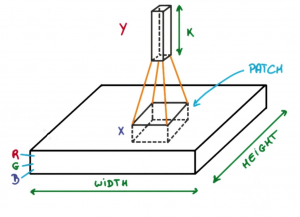

## introduction

Hi, this is my heroic attempt to understand and create CNN model (because this is what AlexNet was as far as I know) that will recognise result on the dice, starting with virtually no knowledge about how neural networks work. Let's begin!

*My journey was leaded by geeksforgeeks tutorials on machine learning and deep learning*

## Table of contents

1. [what's the plan](theory.md#whats-the-plan)
2. [let's do the math](theory.md#lets-do-the-math)
    - [linear algebra](theory.md#linear-algebra)
    - [calculus](theory.md#calculus)
3. [neural networks](theory.md#neural-networks)
    - [layers](theory.md#layers)
    - [activation functions](theory.md#activation-functions)
    - [loss functions](theory.md#loss-functions)
    - [optimizers - ADAM](theory.md#optimizers---adam)
4. [CNNs](theory.md#cnn)
    - [convolutional layer](theory.md#convolutional-layer)
    - [pooling layer](theory.md#pooling-layer)
    - [flattening](theory.md#flattening)
    
## What's the plan

We've got bunch of topics to cover before we jump into neural networks:

- little repetition of linear algebra (matrix operations, transformations)
- calculus - derivatives, gradients, partial derivatives, chain rule
- probability and statistics - distributions, expectation, variance - actually this is pretty easy so I'll skip it

Then we will start with neural networks:

- perceptrons, activation functions
- feedforward computation
- loss functions
- backpropagation
- gradient descent
- overfitting and generalization

And finally CNNs:

- convolution
- feature maps
- pooling layers
- stride, padding
- receptive field
- batch normalization and dropout

A lot of buzzwords to decode!

## let's do the math

#### linear algebra

I at least remember vectors and matrices from linear algebra, but what the hell is **tensor**??

Turns out it's just matrix with more dimensions (or matrix is just 2D tensor) - that's easy start.

and now bunch of non-trivial (for me at least) equations:

1. **dot product** of two vectors

$$
a \cdot b = \sum_{i=1}^{n} a_i b_i
$$

2. **cross product** of two vectors - in effect we're getting a new vector that is perpendicular to both inputs

3. **matrix multiplication** - combines two matrices by taking the dot product of rows of the first one  and columns of the second one

4. **transpose of a matrix** - $A^T$ - rows become columns and vice versa - flip across diagonal 

5. **inverse of a matrix** - $A \times A^{-1}=I$. **Determinant** is a value that indicates that matrix can be inverted. if $det(A)=0$, it can't 

And the last thing from linear algebra that I will cover are Eigen[values/vectors]. These "describe how martices transform space", and I don't get it at all right now.

So there is this equation:
$$
Av=\lambda v
$$
Where $A$ is the matrix (which must be square $n\times n$), $v$ is eigenvector (column $n\times 1$) and $\lambda$ is eigenvalue. 

Okay, so eigenvector is a vector that when multiplied by a matrix, doesn't change it's direction. So for example from $[1,3]$ it will change into $[3,9]$ - when you draw it, it's direction will be the same, it will be just 3 times longer. And the eigenvalue mean how much longer / shorter it will be - in this case it would be $\lambda = 3$. 

I'm getting it now, but why are these important? If matrix is something that **transforms space**, eigenvector show which directions in this space stay unchanged.

But what does it mean that matrix transforms space!?

Let's take a 2D example:
$$
\begin{bmatrix}
2 & 0\\0&1
\end{bmatrix}
$$

Both columns are transformations from original space represented by $I$:
$$
\begin{bmatrix}
1 & 0\\0 & 1
\end{bmatrix}
$$

the first column shows where the x-axis goes, and the second one where y-axis goes

so point $(1,0)$ changes into $(2,0)$, what leads to stretching $x$ axis twice. And point $(0,1)$ stays the same - so the $y$ axis doesn't change at all! Btw, that means that this matrix will have eigenvector, because there are dimensions that doesn't change direction - actually both of them

Next example: rotation
$$
\begin{bmatrix}
0 & -1\\1 & 0
\end{bmatrix}
$$

from $(1,0)$ right into $(0,1)$ - so x-axis goes bottom-up. And from $(0,1)$ to $(-1, 0)$ - so y-axis grows from right to left. In effect we've got 90 degrees rotation counterclockwise! And no direction stays the same - meaning that this matrix has no eigenvectors

And the last example is "Shear":
$$
\begin{bmatrix}
1 & 1\\0 & 1
\end{bmatrix}
$$

from $(0,1)$ to $(1, 1)$ - the grid becomes slanted, and y-axis goes right-up on 45 degrees.

Important - **eigenvectors doesn't have to be on axises!**
They represent directions that aren't changed by the matrix transformation, but this direction doen't have to be parallel to axis! It is kinda non-intuitive, but it works on numbers

So, to sum this up - finding matrices' eigenvectors simplifies transformations that it does - with eigenvector, transformation is simply scaling along its direction

Important thing resulting from this is diagonalization:
$$ A = PDP^{-1} $$

here $A$ is the matrix, $P$ is a matrix whose columns are the eigenvectors of $A$:
$$
P = \begin{bmatrix}
v_1 & v_2
\end{bmatrix}
$$

and $D$ is a diagonal matrix with eigenvalues:
$$
P = \begin{bmatrix}
\lambda_1 & 0\\ 0 & \lambda_2
\end{bmatrix}
$$

and this equation means that $A$ can be seen as a combination of independent scalings, which is much easier to work with than rotations and shears

This note got really messy by now, and this is just the first point of the first section : )

#### Calculus!!

Wy is it important? For optimization mostly - derivatives of models performance (for example function describing how big the error was - error metrics) with respect to its parameters indicate how model reacts to changes in these parameters - so it shows the direction algorithm should take.

So, how we use differential calculus in ML:
- Identifying the goal (function that measures how good is the model, e.g.error metrics)
- optimization - adjusting parameters (as above)
- Gradient descent - let's break this one down:

**gradient descent** helps find a minimum for mathematical function:
$$
\theta_{new}=\theta_{old}-\eta \cdot \nabla f(\theta_{old})
$$

$\theta$ represents parameters of model, $\eta$ is learning rate (how big step we take) and $\nabla f(\theta_{old})$ is a **gradient** - a vector of partial derivatives that shows the direction of steepest ascent

Let's stick to this **gradient** thing for a moment. When we've got a scalar function $f(x_1,x_2,...,x_n)$ with multiple variables, the gradient is a vector of its partial derivatives:
$$
\nabla f = ( \frac{\partial f}{\partial x_1}, \frac{\partial f}{\partial x_2}, ... , \frac{\partial f}{\partial x_n})
$$

So, each component represents the rate of change of $f$ with respect to $x_i$.

Example time!!!!!

[begin example]
$$
f(x,y) = x^2 + 2y^2 \\
\frac{\partial f}{\partial x} = 2x, \ \ \ 
\frac{\partial f}{\partial y} = 4y \\
\nabla f= (2x, 4y)
$$
we've got the gradient, so now we use random starting parameters: $x=2,y=1$ ($f(x,y)=6$), and let's say thay $\eta$ is $0.2$
$$
\nabla f(\theta_{old}) = \nabla f(1,2) = (2\cdot 2, 4 \cdot 1)=(4,4)
$$
so function increases most rapidly in the direction $(4,4)$ - You can visualize it easily on https://www.geogebra.org/3d

So our first step in gradient descent will be:
$$
\theta_{new} = (2,1) - 0.2 \cdot(4,4)\\
\theta_{new} = (1.2,0.2)
$$ 
In this point function's values will be $1.52$ - it's lower, so we go on.

Now we calculate next $\nabla f$, which will be $(2.4,0.8)$, and we step forward until reaching the point that satisfies us or next results will be worse than previous - that will mean that we jumped over the minimum.

[end example]

**chain rule**!!!!!!!

Chain rule allows computing derivatives of complex functions  efficiently - and that is very important for optimizing many-layer model parameters with gradient descent. 

It says that if we have a function $y=f(g(x))$, then:
$$
\frac{\partial y}{\partial x} = \frac{\partial f}{\partial g} \cdot \frac{\partial g}{\partial x}
$$

So this rule allows us to compute the derivatives of:
- loss function with respect to output
- output with respect to weights and biases, layer by layer

Okay turns out this is pretty easy, and the math is done!!

## Neural networks

Network has layers, layers consist of many neurons (perceptrons), that's easy stuff

**Forward propagation** is just passing data forward through following layers - so each neuron receives inputs and calculates some value basing on it's weights and bias:
$$
z=(\sum_{i=1}^n w_ix_i) + b
$$
And then this value is passed to **activation function**. This is crucial because it introduces non-linearity into the system. Popular activation functions are e.g. ReLU, tanh, sigmoid

**backpropagation** allows model's training after forward propagation:
1.  **loss function** is calculated - it says how big is the difference between actual and desired output. We wan't to minimize this one.
2.  Then the gradients of loss function with respect to each weight and bias are calculated. For this, chain rule is used to determine how much each part of the output error depends on each $w$ and $b$. 
3. And at least, weights and biases are updated, using some optimization algorithm (for example gradient descent :) 

So, process of forward propagation and backpropagation iterates many times, parameters enchance, and that leads to loss function decrease over time

**learning types**

Basically we can train the model in 3 ways:
1. Supervised learning - network learns from inputs that have some expected predefined output, and we adjust parameters until network reaches desired error frequency
2. Unsupervised learning - we don't actually know what we're looking for, network searches patterns and relationships on it's own. It is used for example in data clustering and association
3. Reinforcement learning - network interacts with its environment. It receives feedback (rewards or penalties), and it is guided to maximise score. Used e.g. in gaming and decision-making

Okay, at this point the whole thing seems easier than I could expect. But! I feel that I've got only general picture, and it would be cool to understand how components influence networks behavior

### layers

Of course we've got 3 main types of layers - input, hidden, output

**Input layer**'s neurons correspond to the features in the imput data - for example in image processing, each neuron can represent a pixel value. This layer doesn't do any computations, just passes data to the next layer. But it is usually normalized or standarized to improve model performance

**Output layer** - every neuron there corresponds to some output type, for example one class in classification problem or number of outputs in a regression problem. Activation function used in the output layer depends on problem type:
- softmax for multi-class classification
- sigmoid for binary classification
- linear for regression

(We will get deeper into activation functions later)

**Hidden layers** perform most of the network computations. Each hidden layer applies a set of weights and biases to the input data, followed by an activation function to introduce some non-linearity

**types of hidden layers**

1. Dense (fully connected) - most common type. Every neuron in a dense layer is connected to every neuron in previous and subsequent layers. Layer sums weighted inputs and applies activation function, so it's pretty basic case

2. Convolutional layers are used in CNNs for image processing. They use filters to scan across the input and generate feature maps, what helps in detecting edges, textures and other visual features - seems complicated, we'll come back to this in CNN chapter

3. Recurrent layers - used in Recurrent Neural Networks (RNN) for sequence data (like natural language). They have connections that loop back, and this allows information to persist across time steps, providing more context and temporal dependencies to data

4. Dropout layers prevent overfitting. They randomly drop a fraction of the neurons during training - it forces neuron to learn more general features. each neuron is removed with some probability

5. Pooling layer - reduces spatial dimenstion of the data, decreasing complexity of computation and preventing overfitting. 

6. Batch normalization layer - normalizes output of prev layer, and this stabilizes and speeds up training

Damn, there's really a lot of stuff... 

### activation functions

They decide if neuron should be "activated" - whatever that means, in equasions neuron's output is only the functions value, so idk

If these functions were not there, output would always be a linear combination of input, so the network would kinda make no sense

There's of course many useful activation functions, so let's introduce couple of them:

1. **linear** - so we just do nothing with the input. It makes sense only in output layer

2. **sigmoid** - ensures smooth and continuous output that is essential for gradient-based optimizing. Output varies from 0 to 1 (so it's also useful for binary classification). It produces steep gradient when $x$ is between -2 and 2, so it is very changes-sensitive in this range - and that is really helpful during training process.
$$
\sigma(x)=\frac{1}{1+e^{-x}}
$$

3. **tahn** - it's very similar to sigmoid, with it's value stretching between -1 and 1. It is zero-centered, and that helps optimization, what makes tahn more useful in hidden layers.
$$
tanh(x) = \frac{2}{1+e^{-2x}}-1
$$

4. **ReLU** - extremely low-cost and reduces gradient vanishing - and that's why it wins over sigmoid and tanh in most cases
$$
f(x) = max(0,x)
$$

5. **leaky ReLU** - it just includes small impact of negative values by multiplying it by some small value $\alpha$. This leads to better gradient flow over ReLU, because neurons won't get stuck with zero outputs

$$
f(x) =
\begin{cases}
x, \quad x > 0 \\
\alpha x, \quad x \le 0
\end{cases}
$$

6. **softmax** is exponential activation function that handles multi-class classifications. it transforms output scores into probability - so each class has its % assigned - and they sum up to 1. 
$$
softmax(z_i) = \frac{e^{z_i}}{\sum_{j=1}^K e^{z_j}}
$$
$z_i$ is the output of prev layer in the network for the $i^{th}$ class

$K$ is the classes number.

So, seems that every class has it's own neuron in previous layer, and softmax refactors these values into probabilities

7. **softplus** - you could say that this is ReLU alternative, with advantage over it in defferentiating all input values and being smooth and continuous, what may help in optimization

$$
A(x) = log(1+e^x)
$$

So, usage and differences of activation functions are pretty clear for me right now, but there's always more!

### Loss functions

is this loss?

Of course at this moment definition and usage of loss function is completely clear, so I'll immediately move to the types:

#### 1. **Regression Loss Functions** 
used when model predicts continous number

**Mean Squared Error (MSE)** - most widely used, calculates average of squared (so negative diff doesn't cover positive) differences
$$
MSE = \frac{1}{n}\sum_{i=1}^{n}(y_i-\widehat{y}_i)^2
$$

**Mean Absolute Error (MAE)** - less sensitive to outliers comparing to MSE, but it is not differentiable at 0, which can cause issues
$$
MSE = \frac{1}{n}\sum_{i=1}^{n}| y_i-\widehat{y}_i |
$$

**Huber loss** - combines advantages of MSE and MAE - less sensitive ot outliers than MSE and differentiable everywhere. Requires tuning of the paremeter $\delta$
$$
\begin{cases}
\frac{1}{2}(y_i-\widehat{y}_i)^2 \quad \quad \quad \text{for} \  |y_i - \widehat{y}_i| \le \delta \\ 
\delta | y_i-\widehat{y}_i | - \frac{1}{2} \delta^2 \quad \text{for} \  |y_i - \widehat{y}_i| \gt \delta 
\end{cases}
$$

#### 2. Classification Loss Functions

**Binary cross-entropy** - used for binary classification problems - measures the performance of a classification model whose output is a $p$ between 0 and 1:
$$
-\frac{1}{n}\sum^{n}_{i=1}[y_i log(\hat{y}_i) + (1-y_i)log(1-\hat{y}_i)]
$$
Attaching definitions doesn't make sense I guess, most important for me is to know which function applies to what problem, so I'll stop here

**categorial cross-entropy** - used for multiclass problems. Measures performance of a classification model whose output is a $p$ distribution over multiple classes

**sparse categorical cross-entropy** - similar to Categorical CE, but used when the target labels are integers (the are in the log base). More efficient for large datasets with many classes

**KL Divergence** - measures how one probability distribution diverges from a expected probability distribution - used in probabilistic models

#### 3. Ranking Loss Functions

Used to evaluate models that predict the relative order of items, e.g. recommendation systems. 

among them are **contrastive loss**, **triplet loss** or **margin ranking loss**

### Optimizers - Adam

These are functions used to tune model's parameters in backpropagation process. We got through **gradient descent** already, and I would like to clearify one more algorithm - **Adam**

**Adaptive Moment Estimation** combines the advantages of Momentum and RMSprop techniques. It works well with large datasets and complex models. 

#### 1. How does it work

**Momentum** is used to accelerate the gradient descent process by incorporating an exponentially weighted moving average of past gradients. What does it mean?

Update rule with momentum is:
$$
w_{t+1}=w_t-\alpha m_t
$$

$m_t$ is the moving average of the gradients at time $t$, $\alpha$ is learing rate and $w_t$ is the weight at time $t$.

Momentum is updated as:
$$
m_t=\beta_1 m_{t-1} + (1-\beta_1)\frac{\partial L}{\partial w_t}
$$
Where $\beta_1$ is the momentum parameter (typically 0.9), and the partial derivative is the gradient of the loss function with respect to the weights at time $t$.

So, instead of taking only current gradient (as in gradient descent), we're considering also gradients for previous steps, what makes the optimization path more smooth and consistent I would say.

**RMSprop** (root mean square propagation) is an adaptive learning rate method that improves method called AdaGrad. The update rule is:
$$
w_{t+1}=w_t - \frac{\alpha_t}{\sqrt{v_t+ \epsilon}} \frac{\partial L}{\partial w_t}
$$
Where $v_t$ is exponentially weighted average of squared gradients:
$$
v_t=\beta_2v_{t-1}+(1-\beta_2)(\frac{\partial L}{\partial w_t})^2
$$
and $\epsilon$ is some small constant preventing division by zero

This apparently helps overcome the problem of diminishing learning rates

#### 2. Adam equasion
So, Adam optimizer goes as follows:

First moment (mean) estimate:
$$
m_t = \beta_1 m_{t-1} + (1-\beta_1)\frac{\partial L}{\partial w_t}
$$

Second moment (variance) estimate:
$$
v_t=\beta_2v_{t-1}+(1-\beta_2)(\frac{\partial L}{\partial w_t})^2
$$
Bias correction - since both $m_t$ and $v_t$ are initialized at zero, they tend to be biased toward zero, espetially during the initial steps. To correct this bias, adam computes bias-corrected estimates:
$$
\hat{m}_t=\frac{m_t}{1-\beta_1^t} \\ 
\hat{v}_t=\frac{v_t}{1-\beta_2^t}
$$
Weight update:
$$
w_{t+1}=w_t - \frac{\hat{m}_t}{\sqrt{\hat{v}_t} + \epsilon} \alpha
$$
$\alpha$ - learning rate (typically 0.001)

$\beta_1$ and $\beta_2$ - Decay rates, typically set to $\beta_1 = 0.9$ and $\beta_2 = 0.999$

#### 3. Why Adam works so good

Dynamic learning rates - each parameter has it's own adaptive learning based on past gradients. Optimizer avoids oscillations and local minima.

Bias correction - Prevents early-stage instability

Efficient performance - requires fewer hyperparameters tuning adjustments compared to other optimizators, making it more convenient choice for many problems

So yeah, Adam is just go-to optimizer.

## CNN

Finally!

Convolutional Neural Network is adavanced neural network used to extract features from grid-like matrix datasets - just like images!

It consists of multiple layers:

- Input layer

- Convolutional layer

- max pooling layer

- flattening

- dense layer

- output layer

Actually we know how all of these except convolutional layer work

### Convolutional layer

Seems that it takes some small part of an image, and converts it into vertical vector of features (runs smaller neural network (filter) on this patch of image)

So, in effect we've got object that has smaller W and H, but bigger depths (has more channels). And this operation is called convolution

so during forward pass we slide each filter/kernel across the whole input volume step by step, where each step is called **stride**, and we compute the dot product between kernel weights and patch from input. Eventually we'll get 2-D output for each filter and we'll stack them together as a result - so result depth will equal to the number of filters

**filter** is exactly small matrice that extracts specific feature form the input (e.g. horizontal edge). The values in filter are updated during training.

**stride** refers to the step size with which the filter moves across the input data - larger strides result in smaller output feature maps and faster computation

**padding** are zeros or other values added around the input to control the spatial dimensions of the output, e.g. "same" padding ensures that output w and h is equal to input w and h 

**activation function** is also applied on the convolution output

#### steps in convolution layer

1. Init filters with random values
2. Convolve filters with input - slide the filters across the w and h of input data, computing the dot product between filter and input patch
3. apply activation function
4. pooling (optional) - reduce the spatial dimensions

### Pooling layer
Pooling layer just reduces the size of volume by choosing some representational value for data chunk, for example max or average value (max pooling, average pooling - two main types). So pooling additionally decreases data width and height

### Flattening
Feature maps that are a result of previous layers are flattened into a one-dimensional vector so they can be passed into dense layers that perform the task given to the network (categorization, regression)